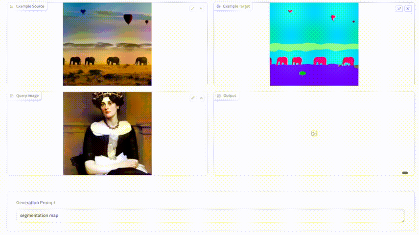

# US-Diffusion 

**[Underlying Semantic Diffusion for Effective and Efficient In-Context Learning]** **(code coming soon!!!)**

[](http://arxiv.org/abs/2503.04050) 
[](https://us-diffusion.github.io/)

> **Abstract:** Diffusion models has emerged as a powerful framework for tasks like image controllable generation and dense prediction. However, existing models often struggle to capture underlying semantics (e.g., edges, textures, shapes) and effectively utilize in-context learning, limiting their contextual understanding and image generation quality. Additionally, high computational costs and slow inference speeds hinder their real-time applicability.To address these challenges, we propose Underlying Semantic Diffusion (US-Diffusion), an enhanced diffusion model that boosts underlying semantics learning, computational efficiency, and in-context learning capabilities on multi-task scenarios. We introduce Separate \& Gather Adapter (SGA), which decouples input conditions for different tasks while sharing the architecture, enabling better in-context learning and generalization across diverse visual domains. We also present a Feedback-Aided Learning (FAL) framework, which leverages feedback signals to guide the model in capturing semantic details and dynamically adapting to task-specific contextual cues. Furthermore, we propose a plug-and-play Efficient Sampling Strategy (ESS) for dense sampling at time steps with high-noise levels, which aims at optimizing training and inference efficiency while maintaining strong in-context learning performance. Experimental results demonstrate that US-Diffusion outperforms the state-of-the-art method, achieving an average reduction of 7.47 in FID on Map2Image tasks and an average reduction of 0.026 in RMSE on Image2Map tasks, while achieving approximately 9.45× faster inference speed. Our method also demonstrates superior training efficiency and in-context learning capabilities, excelling in new datasets and tasks, highlighting its robustness and adaptability across diverse visual domains.

## Dynamic Demonstration
<div style="text-align: center;">
  
</div>

[📺 Full Video Demonstration](./assets/demo_video.mp4)

## Release
- [x] Release README documentation
- [x] Release demo project and assets
- [ ] Release code implementation

## Citation
```bibtex
@article{ji2025underlying,
  title={Underlying Semantic Diffusion for Effective and Efficient In-Context Learning},
  author={Ji, Zhong and Cao, Weilong and Zhang, Yan and Pang, Yanwei and Han, Jungong and Li, Xuelong},
  journal={arXiv preprint arXiv:2503.04050},
  year={2025}
}
